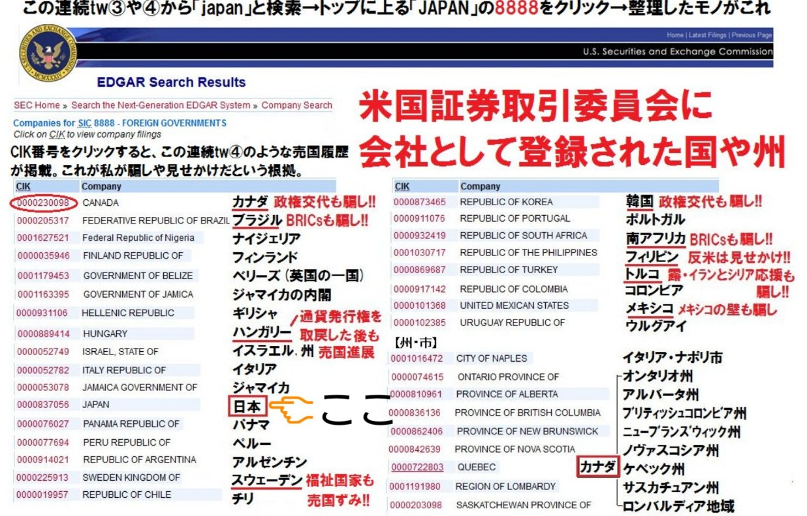
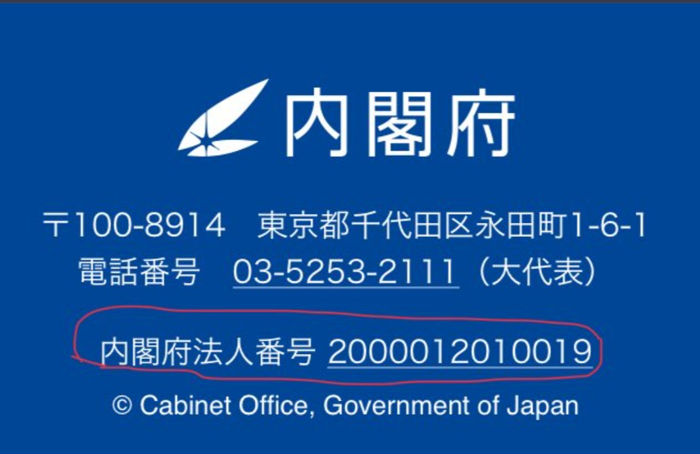
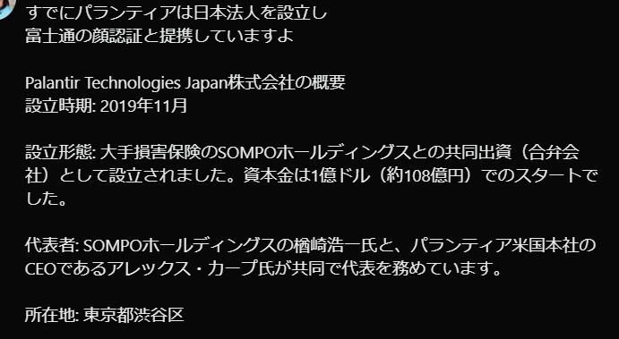
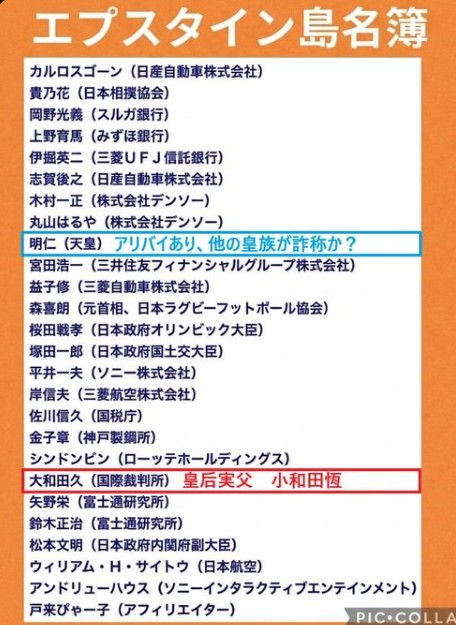
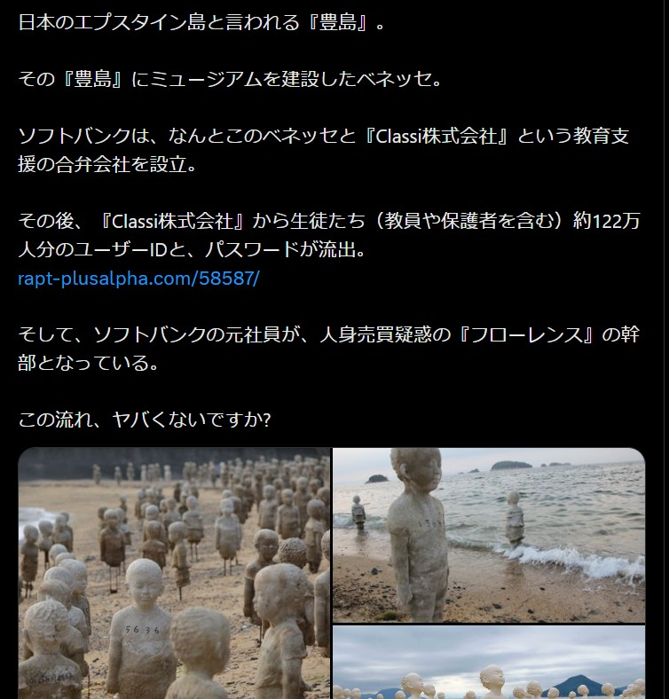

# 02: Japan Inc. - The Corporate Enslavement OS
# 02: 日本株式会社：企業化された奴隷OSの正体

This section exposes how Japan is operated not as a nation, but as a corporate entity for global exploitation.
このセクションでは、日本が国家ではなく、グローバルな搾取のための「法人」として運用されている実態を暴く。

---

### [1. Japan as a Registered Corporation / 日本株式会社の登録証拠]
Japan is registered with the SEC (U.S. Securities and Exchange Commission) as a commercial entity.
日本は米証券取引委員会（SEC）に登録された「法人」であり、その法人番号は国民を資産として管理するためのものである。

---

### [2. The Eye of the Elite: Palantir / エリートの監視眼：パランティア]
The deployment of Palantir in Japan marks the start of full-scale biometric and digital surveillance.
日本におけるパランティアの展開は、生体データおよびデジタル監視の本格始動を意味する。

---

### [3. The Blood Covenant & Sanctuaries / 血の盟約と日本の聖域]
Evidence of the deep-rooted connections between the global elite network and specific sites in Japan.
グローバル・エリートのネットワークと、日本の特定の聖域（豊島等）との深い繋がりの証拠。

---
**"Wake up, Japan. You are not citizens, you are assets." - JIN-ORDER Sovereign Masano**
