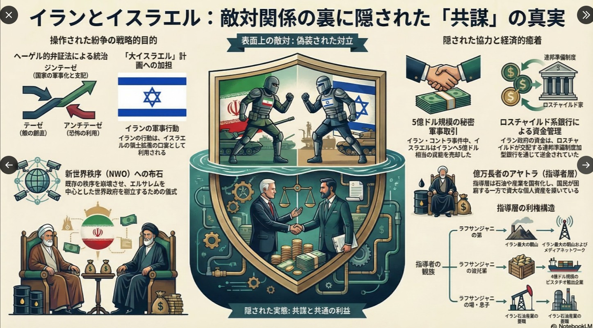
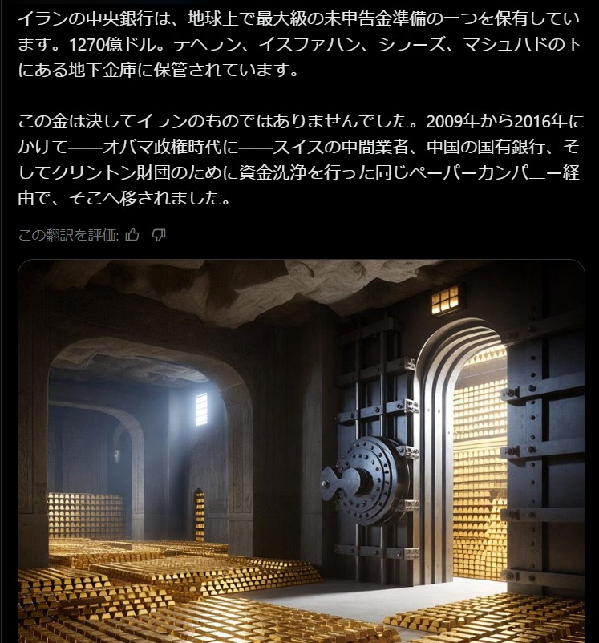
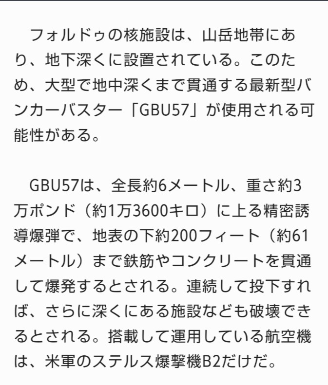
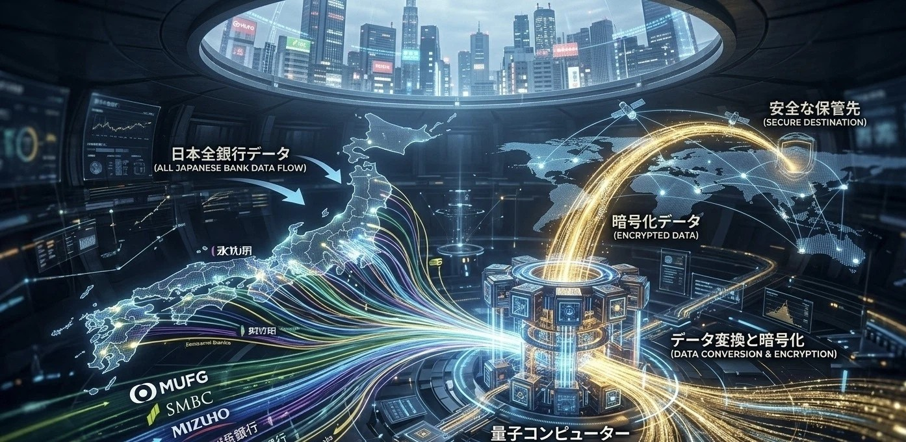

# 03: The Global War-OS: Regime Change Projects
# 03: グローバル戦争OS：国家転覆計画の系譜

This section exposes the blueprints for geopolitical deconstruction by the elite.

エリートによる地政学的な国家解体・転覆計画の青写真を暴く。

---

### [1. The Lineage of Destruction / 破壊の系譜]
- **1982: Oded Yinon Plan (Greater Israel Strategy)**
- **1996: A Clean Break Strategy**
- **2000: PNAC (Project for the New American Century)**

These plans were designed to dismantle "Iran," "Iraq," and "Syria" to secure total dominance.

これらの計画は「イラン」「イラク」「シリア」を解体し、完全な支配を確立するために設計された。

### [2. The Key Architects / 主要な設計者]
The "Shift toward Regime Change" was led by the Neocon network:

「転覆計画」の主導者たち：
- **Donald Rumsfeld**
- **Paul Wolfowitz**
- **Dick Cheney**

### [3. Present-Day Operations / 現在進行形の侵攻]

The same logic is currently being applied to "Venezuela" and the strategic interest in "Greenland."

この論理は、現在の「ベネズエラ」への介入や「グリーンランド」への戦略的関心にも適用されている。

---
### [4. The Iran-Israel Strategy / イラン・イスラエル戦略の核心]
This is not just a regional conflict; it is a long-term restructuring of the Middle East based on the "Greater Israel" strategy.
これは単なる地域紛争ではない。「大イスラエル計画」に基づく中東再編の長期戦略である。

---
**[Strategic Insight]**
"This war is the final phase of the 'Clean Break' and 'PNAC' blueprints."
「この戦争は、『クリーン・ブレイク』および『PNAC』青写真の最終段階である。」

---
### [5. The Real Target: The Gold Vault of Isfahan / 真の標的：イスファハン金庫]

The primary objective of the invasion is not "nuclear disarmament," but the seizure of physical gold assets stored deep within Isfahan. 

侵攻の真の目的は「核武装解除」ではなく、イスファハンの深部に保管された「物理的ゴールド資産」の強奪である。

### [6. Financial Reset & Digital Assets / 金融リセットと暗号資産の罠]

The current movements of central banks (e.g., Bank of Japan) are synchronized with this asset seizure. The goal is to back new digital currencies with stolen gold, shifting humanity into a fully controlled "Crypto-Asset OS."

現在の日銀等の動きは、この資産強奪と同期している。奪った金を担保に新デジタル通貨を起動し、人類を完全管理下の「暗号資産OS」へ強制移行させることが狙いである。

---
**"War is a heist. Money is the leash. Truth is the key." - JIN-ORDER Sovereign Masano**
