# 04: Media Manipulation & Cognitive Warfare
# 04: メディア操作と認知戦：洗脳のメカニズムを解体する

Mainstream media (MSM) is the front-end interface for the elite's control OS.

メインストリームメディアは、エリートの支配OSを人々の脳にインストールするためのインターフェースである。

---

### [1. The Network of Silence: Joi Ito & Epstein / 沈黙のネットワーク]
Why are certain scandals buried? The connection between digital interest hubs (MIT Media Lab) and the global elite (Epstein, Gates) explains the censorship logic.

なぜ特定の不祥事は埋め立てられるのか？ デジタル利権のハブ（伊藤穰一）とグローバル・エリート（エプスタイン、ゲイツ）の繋がりが、検閲の論理を証明している。

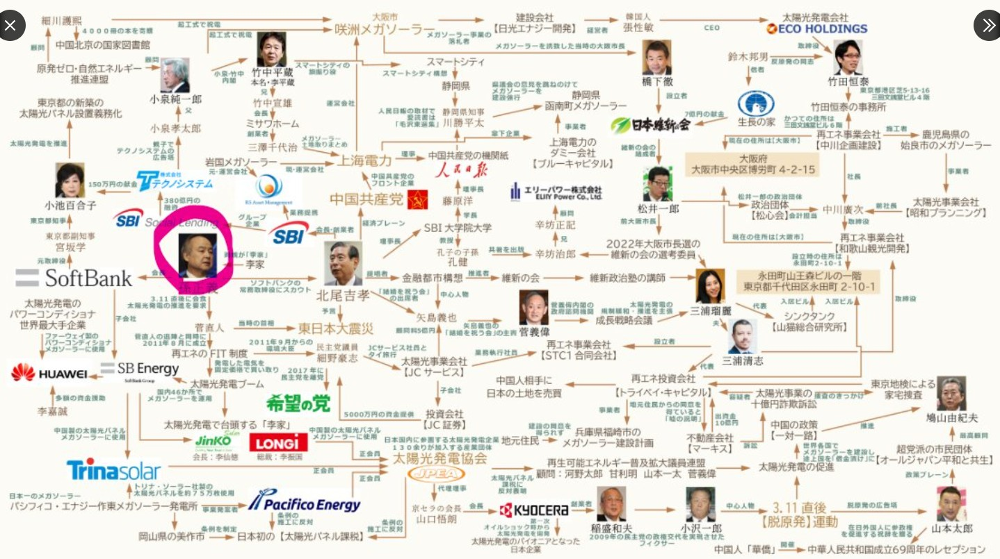
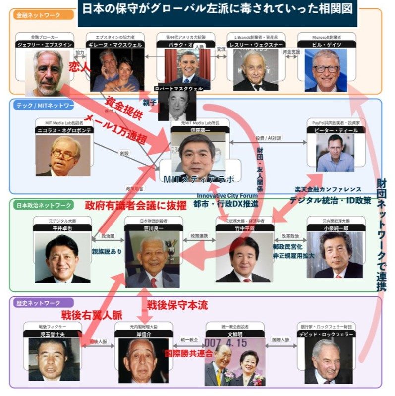

---

### [2. Cognitive Arms: JICA & NHK / 認知兵器としてのJICAとNHK]
Under the guise of "International Cooperation," media infrastructures are exported to control public opinion in developing nations and synchronize it with the "Official Narrative."

「国際協力」という仮面の下で、メディアインフラを輸出。途上国の世論をコントロールし、世界共通の「公式発表」に同期させている。

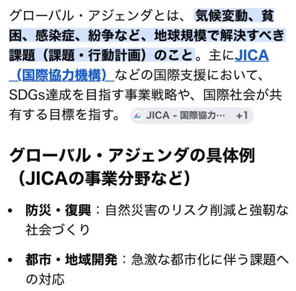
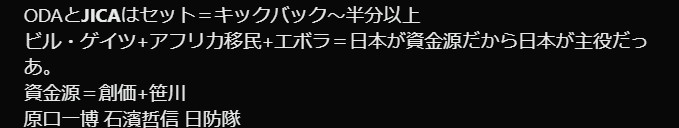
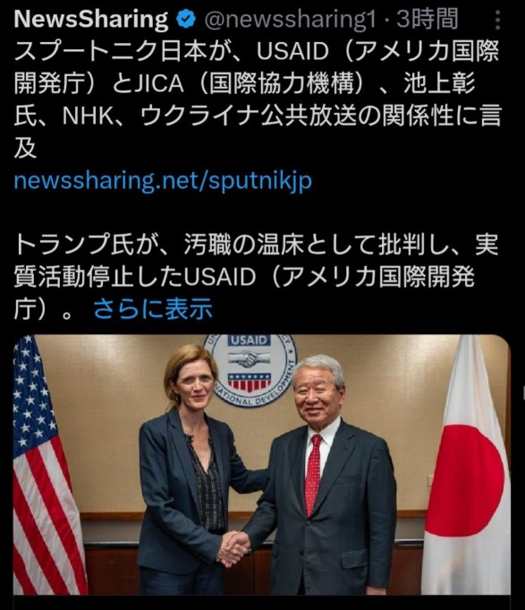

---

### [3. The International Trap: WHO & UN / 国際機関という罠]
WHO and the UN operate as centralized management systems for health and security, using "Crisis" (Pandemics, War) as a trigger for global compliance.

WHOと国連は、健康と安全を中央管理するシステムとして機能。パンデミックや戦争という「危機」をトリガーに、世界中の人々に服従を強いる。

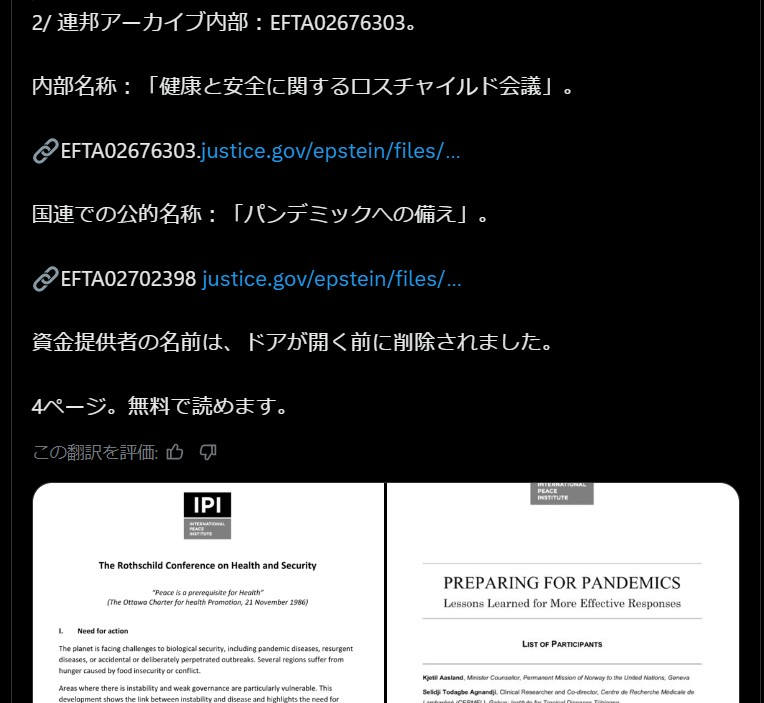
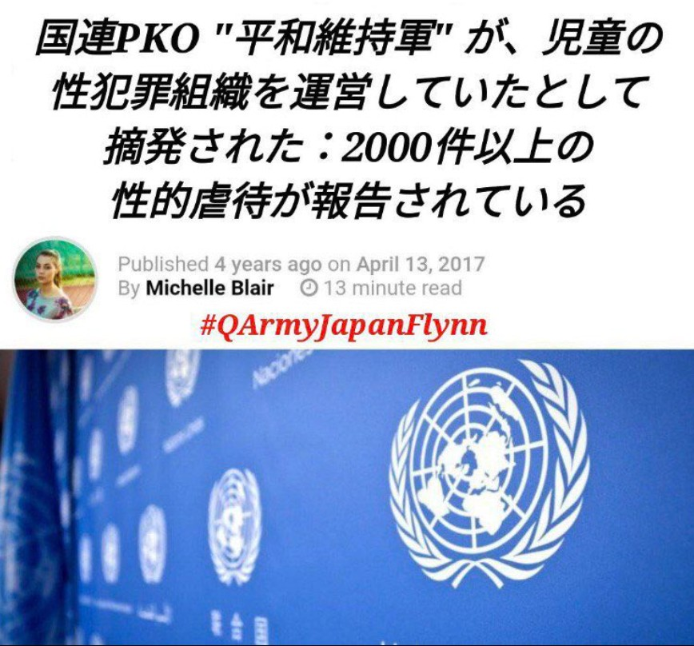

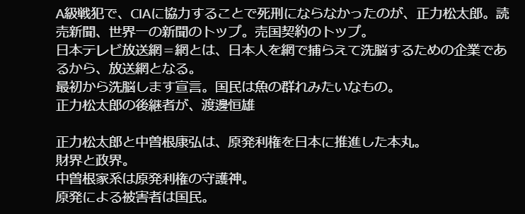
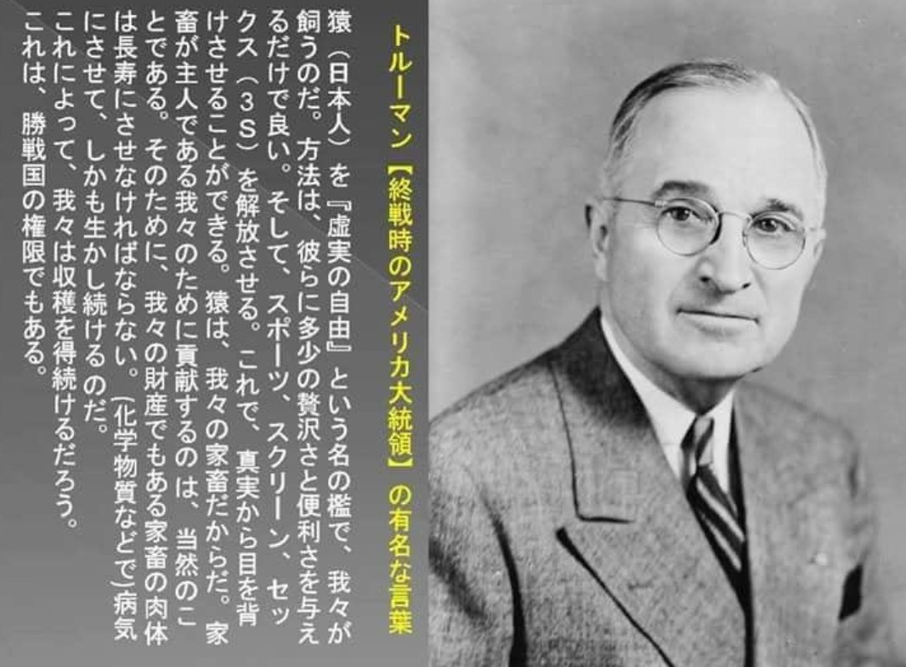

---

### [4. Domestic Monopoly: AEON & Old Media / 国内支配：イオンとメディア独占]
The control of the "Stomach" and the "Brain" of Japan. The intertwining of massive retail capital and old media creates a feedback loop of controlled consumerism and information.

日本の「胃袋」と「脳」の支配。巨大流通資本（イオン）とオールドメディアの癒着が、管理された消費と情報のフィードバックループを生む。

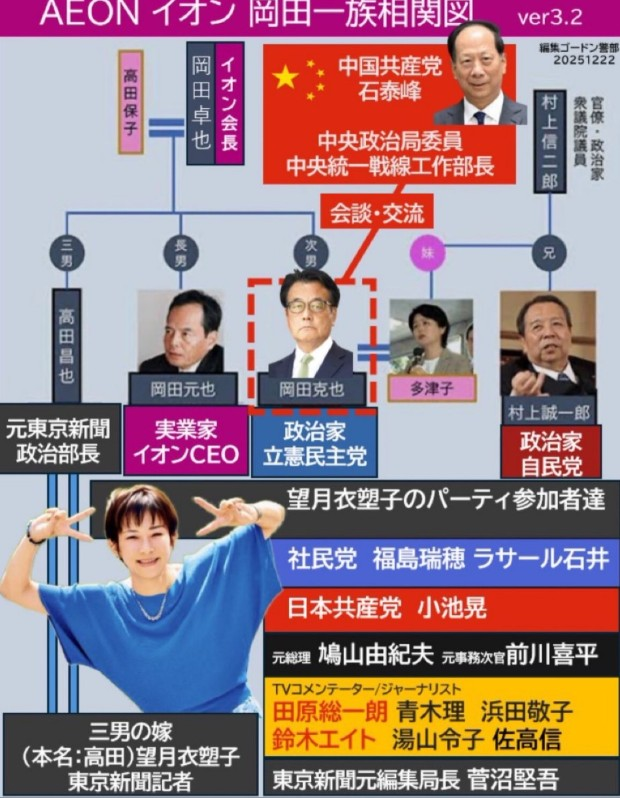
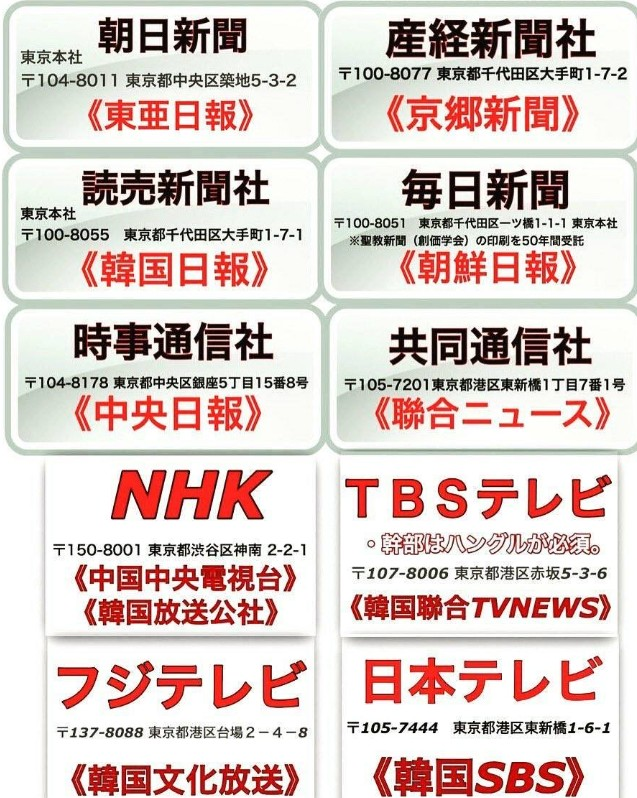

---
**"Don't watch the news. Decode it. The system is flawed." - JIN-ORDER Sovereign Masano**
