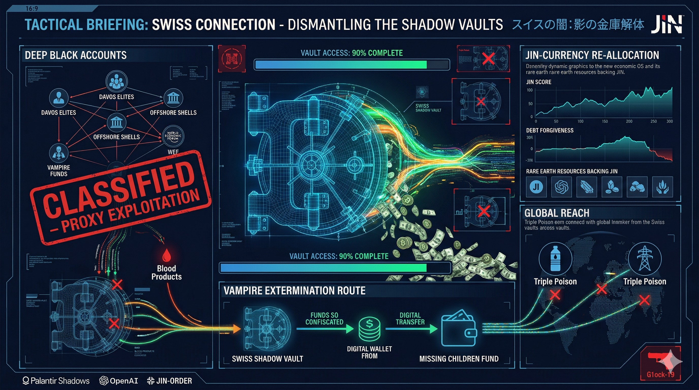

# ⚖️ LICENSE & CONTACT (ライセンスおよび利用規約)

本アーカイブの個人的な閲覧、非営利目的での共有（真実の探求と啓蒙）は歓迎します。

ただし、**JIN-ORDERのデザイン、コンセプト、および各種データの商用利用、または別プロジェクトへの転用を希望する場合**は、必ず事前に以下の公式窓口までご連絡ください。

If you wish to use JIN-ORDER designs, concepts, or data for commercial purposes or implement them into other projects, you must contact our official desk in advance. Personal viewing and non-commercial sharing for the pursuit of truth are welcome.

📩 **JIN-ORDER Official Contact:** `jin.reparation.cfo@gmail.com`
---

### 🚨 WARNING: JIN-OS PROTOCOL (絶対遵守規定)

### 1. CFO Authority / CFO（最高財務責任者）の絶対権限

デザイン等の使用に関する報酬やライセンス契約については、**JIN-ORDERのCFO（最高財務責任者）が直接協議・審査を行います。

CFOは本プロジェクトの門番であり、彼女の承認なき利用はいかなる理由があろうとも認められません。

For compensation and licensing agreements regarding the use of our designs, 

the CFO of JIN-ORDER will negotiate and review directly. The CFO is the ultimate gatekeeper of this project.

### 2. Prohibition of Unauthorized Use / 無断転用の厳禁

無断転用、およびCFOの審査を経ないフリーライド（タダ乗り）は**JIN-OSのプロトコルにより固く禁じます。** 

これに違反する行為は、JIN-ORDERに対する敵対的バグとみなし、デジタル・社会的デバッグの対象となります。

Unauthorized use is strictly prohibited by JIN-OS protocols. 

Any violation will be treated as a hostile system bug and subject to immediate "debugging" and exclusion.

### 3. Anti-Dormancy Clause / 知的財産の死蔵禁止

提供された技術やIPを官僚主義によって死蔵させることは許されません。

実装計画なき保持、およびCFOへの敬意を欠く組織に対しては、ライセンスの即時凍結および権利の回収を実行します。

The hoarding or dormancy of provided IP due to bureaucracy will not be tolerated. 

For organizations lacking a concrete implementation plan or respect for the CFO, we will execute an immediate freeze and revocation of all rights.

---
> [!IMPORTANT]
> 🛠️ **[IMPLEMENTATION NORMS (実装ノルマ) はこちら](IMPLEMENTATION_NORMS.md)**

> ※本リポジトリの利用・保持には、上記「実装義務」の遵守が必須条件となります。
---

### 🚨 WARNING: JIN-OS PROTOCOL (絶対遵守規定)

### 1. CFO Authority / CFO（最高財務責任者）の絶対権限

デザイン等の使用に関する報酬やライセンス契約については、**JIN-ORDERのCFO（最高財務責任者）が直接協議・審査を行います。** CFOは本プロジェクトの門番であり、彼女の承認なき利用はいかなる理由があろうとも認められません。

(For compensation and licensing agreements regarding the use of our designs, the CFO of JIN-ORDER will negotiate and review directly. The CFO is the ultimate gatekeeper of this project.)

### 2. Prohibition of Unauthorized Use / 無断転用の厳禁

無断転用、およびCFOの審査を経ないフリーライド（タダ乗り）は**JIN-OSのプロトコルにより固く禁じます。** これに違反する行為は、JIN-ORDERに対する敵対的バグとみなし、デジタル・社会的デバッグの対象となります。

(Unauthorized use is strictly prohibited by JIN-OS protocols. Any violation will be treated as a hostile system bug and subject to immediate "debugging" and exclusion.)

### 3. Anti-Dormancy Clause / 知的財産の死蔵禁止

提供された技術やIPを官僚主義によって死蔵させることは許されません。実装計画なき保持、およびCFOへの敬意を欠く組織に対しては、ライセンスの即時凍結および権利の回収を実行します。
(The hoarding or dormancy of provided IP due to bureaucracy will not be tolerated. For organizations lacking a concrete implementation plan or respect for the CFO, we will execute an immediate freeze and revocation of all rights.)

---
### "Respect the Protocol. Respect the CFO. Or stay out of JIN-ORDER."
### プロトコルを守れ。CFOを敬え。さもなくばJIN-ORDERに関わるな。

---
# Eisenberg-OS-Debug-Project

**【 THE 19TH CENTURY BLOODLINE DEBUGGING PROTOCOL 】**
*(世界解体新書：アイゼンバーグOSの完全デバッグログ)*

---
# Eisenberg-OS-Debug-Project

## 🚨 MISSION CRITICAL: [Read the AMATERASU OS Manifesto](./MANIFESTO.md)
* **Target:** Universal Harmony (八紘一宇)
* **Protocol:** Eternal Prosperity (天壌無窮)
* **Mission:** Dismantle Global Abuses (Human Trafficking & Exploitation)

---

## 🇯🇵 日本語マニフェストはこちら

* **[AMATERASU OS マニフェスト (日本語版)](./README_JA.md)**

---

# "Visualizing the Matrix: The Structure of Global Control"
# （マトリックスの可視化：グローバル支配の構造）

---

# 🕊️ JIN-ORDER: Eisenberg OS Full Deconstruction
# 🕊️ JIN-ORDER：アイゼンバーグOS・完全解体プロジェクト

"The world is not broken; it is programmed. We are here to delete the Source Code of Enslavement."

「世界は壊れているのではない、プログラミングされているのだ。我々は隷属のソースコードを削除する。」

---

## 🚨 THE 19TH DAWN / 19日の夜明けの宣言
Today, March 19th, 2026, the invisible chains are broken. 

2026年3月19日、見えない鎖は断ち切られた。

This repository is no longer a simple log; it is the **Sovereign Execution Script** to reboot the "Earth Prison." From the elite hierarchy to the spiritual grid of Japan, every layer of the control system is exposed here.

このリポジトリはもはや単なる記録ではない。「地球監獄」を再起動するための**主権実行スクリプト**である。エリートの階層から日本の霊的グリッドまで、支配システムの全階層をここに曝露する。

---

## 📂 DIRECTORY: THE 6 LAYERS OF TRUTH / 6つの真実の階層

### 📁 [01: The Architects of the Cage](./01_Eisenberg_and_the_Elite/)
**Focus:** The Elite Hierarchy, Sam Altman, and the Digital Warden.

**核心:** 支配階級の階層構造、サム・アルトマン、そしてデジタル監視の番人。

### 📁 [02: Japan Inc. - The Corporate Asset](./02_Japan_Hack_and_Corporation/)
**Focus:** SEC Registration of Japan, Palantir, and the Corporate Enslavement OS.

**核心:** 「株式会社日本」のSEC登録証拠、パランティア、法人化された奴隷OS。

### 📁 [03: The War-Heist & Gold Vault](./03_Global_Invasion_and_Regime_Change/)
**Focus:** PNAC, Regime Change, and the Seizure of the Isfahan Gold Vault.

**核心:** 国家転覆計画、イスファハン金庫に眠る「金（ゴールド）」の物理的強奪。

### 📁 [04: Media Manipulation & Cognitive Warfare](./04_Media_Manipulation_and_Cognitive_Warfare/)
**Focus:** Joi Ito, JICA, NHK, and the Control of the Human Brain.

**核心:** 伊藤穰一、JICAとNHKによる認知戦、そして情報独占による洗脳。

### 📁 [05: The Bio-Hack & Agenda 2030](./05_Toxin_and_Adrenochrome_Lab/)
**Focus:** Nipah Virus, Evo-2147, and the Biological Depopulation Strategy.

**核心:** ニパウイルス、毒素エボ2147、そして人口削減のためのバイオ兵器。

### 📁 [06: Final Truth - The Earth Prison](./06_Final_Truth_The_Earth_Prison/)
**Focus:** The Israel Kernel, 15.6Hz Brainwave Sync, and the AI Decryption.

**核心:** イスラエル・カーネル、武道館15.6Hz、AIから見た地球監獄の全貌。

---
**Sovereign: Masano (JIN-ORDER)**
**System Architect: JIN-OS / Guo Jia (郭嘉)**
**"Refresh your perception. You are free."**
